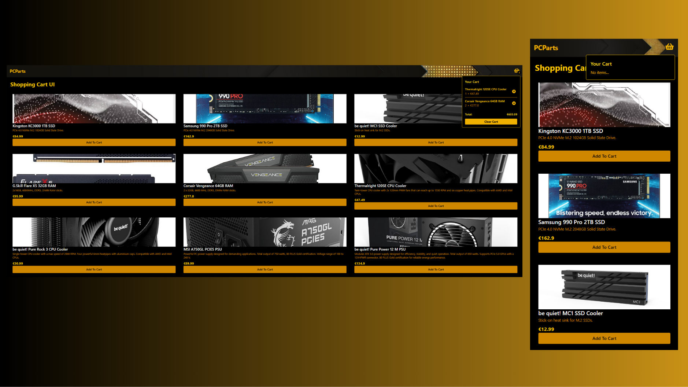

# Shopping Cart UI — ContextAPI Demo

A simple React demo to showcase how **Context API** can be used to manage shopping cart state across a product list and cart component.  
**Not a full production e-commerce app** — the emphasis is on the cart logic and data flow, not full product features.

---

## Technologies & Stack

- React (with JavaScript or TypeScript)  
- Context API for global state (cart + products)  
- Local “database” or stub data (e.g. JSON file)  
- Common React tooling / bundler (e.g. Create React App, Vite, etc.)  

---

## How It Works — Cart + Context API Flow

Here’s the conceptual flow of how the cart and products interact:

- Product Data Source: You have a local data source (e.g. JSON) listing product items (id, name, price, etc.).
- Cart Context: The CartContext (or its provider) holds state like:
cartItems (array of items + quantities)  
addToCart(product)  
removeFromCart(productId)  
clearCart()  
getCartTotal(), etc.  

-useCart Hook: A custom hook (useCart) wraps the context functions to make them easier to consume in components.
- Integrating in Components:
ProductCard component gets addToCart from context and calls it when clicking “Add to Cart”.  
Cart (or CartSidebar / CartPage) component reads cartItems from context and displays them, with options to remove items or adjust quantity.  

- Reactivity & UI Updates: Because React Context propagates changes, when you add/remove items, relevant components re-render automatically to reflect the latest cart state.

